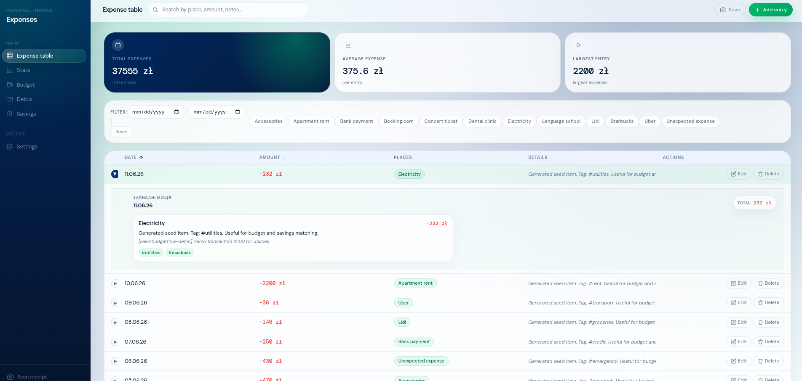
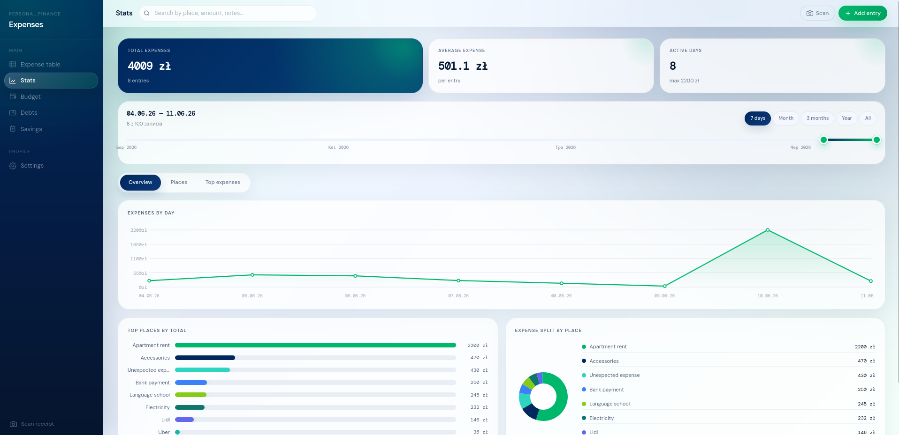
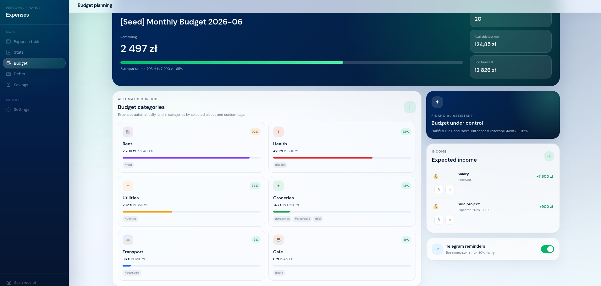

# BudgetFlow

BudgetFlow is a small personal finance app that helps keep money out of your head and messy spreadsheets. You can track expenses, review stats, plan a budget, manage debts, follow savings goals, and scan receipts when you do not feel like typing everything by hand.

The project is built as a monorepo: the React frontend, .NET API, PostgreSQL database, and Telegram bot live together and run through Docker Compose.

## What It Does

- Tracks expenses in a table with search, filters, sorting, details, tags, and multiple currencies.
- Connects budget categories to expense tags: when a table entry has the matching tag, it appears in the related budget category automatically.
- Uses the same tag idea for savings goals, so tagged expenses or contributions can show up in the right savings jar.
- Keeps debts in one place, including money you owe and money owed to you, with payments, due dates, and status tracking.
- Scans receipts, currently focused on Polish receipts.
- Lets you choose the base currency, app language, font size, Telegram accounts, and notification rules in settings.

## Telegram Bot

**Planned soon:** the Telegram bot is not the main user flow yet, but it is planned as a visible part of BudgetFlow. It will send alerts when spending in a budget category gets close to its limit, open the app as a Telegram Web App, and support quick operations such as basic CRUD actions for expenses, debts, savings, and budget items.

## Interface

### Expense Table




### Stats And Planning




## Deploy

The site is deployed with Docker Compose from the repository root.

### 1. Prepare the server

Install Docker and Docker Compose on the server, then clone the repository:

```bash
git clone <repository-url>
cd BudgetFlowApp-monorepo
```

### 2. Create environment variables

Create a `.env` file in the repository root:

```env
POSTGRES_DB=budgetflow
POSTGRES_USER=budgetflow_user
POSTGRES_PASSWORD=change_this_password
JWT_KEY=change_this_to_a_long_secure_secret_key
```

Use strong production values for `POSTGRES_PASSWORD` and `JWT_KEY`.

### 3. Configure allowed origins

In `docker-compose.yml`, update the API CORS origins for the production host:

```yaml
Cors__AllowedOrigins__0: http://SERVER_IP
Cors__AllowedOrigins__1: https://domain.com
```

Use the real server IP address or domain name.

### 4. Build and start

Run:

```bash
docker compose up -d --build
```

The frontend is served on port `80`. API requests from the frontend are proxied through `/api` to the backend container.

### 5. Check deployment

Open:

```text
http://SERVER_IP
```

## License

This project is distributed under the BudgetFlow Non-Commercial License, Version 1.0.

Commercial use is not allowed without prior written permission from the copyright holder.

See the full license text in [LICENSE](LICENSE).
